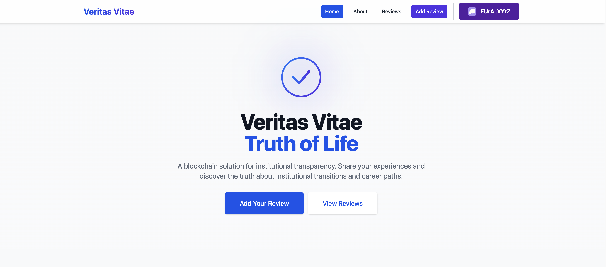
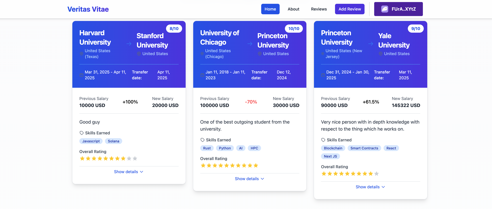
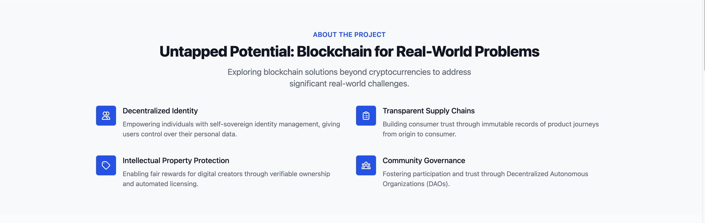

# Review Frontend

Contains a single page application for interacting with the Veritas Vitae program

## Getting Started

First, install required libraries:

```bash
npm install
```

Then, run the development server:

```bash
npm run dev
```

Open [http://localhost:3000](http://localhost:3000) with your browser to see the result.

You can start editing the page by modifying `pages/index.tsx`. The page auto-updates as you edit the file.

## UI Screenshots

### Homepage


_Main landing page of Veritas Vitae showing the application introduction and key features._

### Reviews Page


_Display of institutional reviews submitted to the blockchain, showing transitions between organizations, ratings, and skills earned._

### About Page


_Information about the Veritas Vitae project, explaining how blockchain is used for real-world problems like credential verification._

### Info Page


_Form interface for submitting new institutional reviews to the blockchain._
